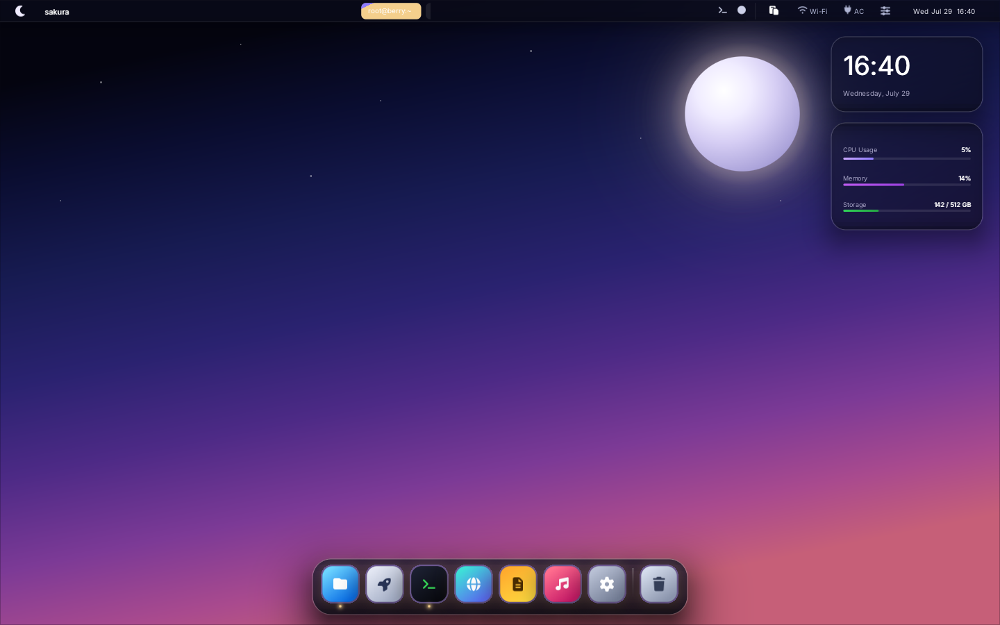

**🚀 Luna Desktop**

A **pure Rust** Wayland compositor + custom `libwayland-client` implementation + macOS-style desktop shell (`luna-shell` / `ui/luna-shell.c`). Run GTK4 apps while replacing Xorg or Weston!

[](https://github.com/sponsors/yui0)




---

## 🏷️ Product Names & Layers

| Name              | Actual Binary       | Role |
|-------------------|---------------------|------|
| **Luna Desktop**  | Full session        | The complete desktop environment users see after kernel boot |
| **luna-compositor** | `luna-compositor`  | DRM/KMS Wayland compositor (Xorg/Weston replacement) |
| **luna-shell**    | `ui/luna-shell.c`   | macOS-style menu bar, Dock, Launchpad & widgets (Luna UI engine) |
| **Luna UI**       | `ui/luna-ui.h` HTML/CSS engine | UI toolkit for shell & settings apps |
| **wayland-client-rs** | `libwayland_client.so` | Pure Rust client lib that GTK apps connect to |

**Internal codename:** Vespera
**User-facing name:** **Luna** (short, memorable, like GNOME/KDE)

## 🔄 Boot Flow (After Kernel)

```bash
systemd / init
  └─ luna-session
       ├─ luna-compositor  (--backend dri) ✨
       ├─ luna-shell       (luna-shell --desktop) 🌙
       └─ GTK Apps         (WAYLAND_DISPLAY + LD_PRELOAD=libwayland-client) 📱
```

## 🌙 luna-shell — the Luna Desktop shell

`ui/luna-shell.c` renders a full macOS-style desktop with the Luna UI engine alone:

- Translucent menu bar — crescent-moon Luna menu, clock, network & power status
- Dock with hover magnification, running-app indicators and Trash
- Launchpad app grid with incremental search (Super / F4)
- Control Center — toggles, brightness/volume sliders, CPU/RAM meters
- Desktop widgets — clock plus CPU/memory/disk stats read from /proc
- About This Luna, notification toasts, Shut Down / Restart / Log Out dialogs

Dock & Launchpad apps are overridable via `LUNA_APP_<NAME>` (e.g. `LUNA_APP_TERMINAL=foot`).
The layout (`ui/luna-shell.html` + `ui/luna-shell.css`) is embedded into the binary and can be
replaced with `LUNA_DESKTOP_LAYOUT` / `LUNA_DESKTOP_CSS` or `--layout` / `--css`.

### Desktop skins

Open **System Settings → Appearance → Desktop Skin** to switch skins while the
shell is running. The choice is saved in `~/.config/luna-shell/settings.conf`.
Bundled themes under `skins/` include **Windows XP**, **Windows 95**, **BeOS**,
**Classic Mac OS**, **Amiga Workbench**, and **Nocturne Atelier**.

A skin is an external directory with this shape:

```text
my-skin/
├── skin.conf
├── style.css
├── layout.html        # author in a browser; same file is the shell layout
├── gtk/<ThemeName>/   # optional GTK 3/4 theme (index.theme + gtk.css)
│   ├── index.theme
│   ├── gtk-3.0/gtk.css
│   └── gtk-4.0/gtk.css
└── qt/
    ├── style.qss      # optional Qt stylesheet (Fusion + qt5ct/qt6ct)
    └── colors.conf
```

`layout.html` is the development surface. Link the shared base sheet and the
skin overrides so a normal browser tab matches the running desktop:

```html
<link rel="stylesheet" href="../_base/luna-shell.css">
<link rel="stylesheet" href="style.css">
```

Open `skins/<name>/layout.html` in a browser, edit HTML/CSS there, and use the
same files as the theme — luna-shell loads those `<link>`s via the existing
HTML/CSS engine. Shared base CSS lives in `skins/_base/` (not a skin itself);
icon fonts live in `skins/fonts/` (resolved as `../fonts` from `_base`). If
`layout.html` is present it is picked up automatically (override with `layout=`
in `skin.conf`).

```ini
name=My Skin
description=A short label shown in Appearance
css=style.css
layout=layout.html
# Chrome placement (applied live to Wayland layer-shell surfaces):
chrome=taskbar          # taskbar | deskbar | menubar | luna
menubar_edge=bottom     # top | bottom  (overrides chrome preset)
menubar_height=34       # exclusive-zone height in px
dock_mode=hidden        # float | hidden
# Toolkit themes (new apps pick these up; restart running GTK/Qt apps):
gtk_theme=LunaWindows95
qt_style=Fusion
qt_qss=qt/style.qss
# Compositor SSD chrome:
titlebar_style=2        # 0 modern | 1 classic dots | 2 flat retro
titlebar_active=#000080
titlebar_inactive=#808080
titlebar_frame=#c0c0c0
prefer_ssd=1            # recommend server decorations when client unset
```

`chrome=taskbar` pins the menubar to the **bottom** of the screen (Windows XP /
95) and hides the floating dock so apps live in the taskbar window list.
`chrome=deskbar` / `menubar` keep a top strip without a dock. CSS alone cannot
move the menubar on Wayland — the shell re-anchors the layer surface from these
keys.

Selecting a skin also installs its GTK theme under `~/.local/share/themes/`,
updates `gtk-3.0`/`gtk-4.0` `settings.ini`, exports `GTK_THEME` /
`QT_STYLE_OVERRIDE` / `LUNA_QT_QSS`, and pushes SSD colors to the compositor.
Tray and Start menus open toward the active chrome edge (above a bottom
taskbar, below a top menubar).

Put it in `~/.local/share/luna-desktop/skins/`,
`/usr/local/share/luna-desktop/skins/`, `/usr/share/luna-desktop/skins/`, or a
directory named by `LUNA_SKIN_PATH`. CSS and chrome changes apply immediately.
A custom HTML layout is loaded on the next sign-in and must preserve the
element IDs in `ui/luna-shell.html` so native shell actions remain connected.
Skins can also be selected with `--skin NAME` or `LUNA_DESKTOP_SKIN=NAME`.

Wayland protocol is used as an **internal bus**. No Weston, Mutter, or Xorg needed. GTK4 connects directly to the Vespera compositor.

## 🛠️ Try It on Your Dev Machine

```bash
cd vespera
make desktop              # 🚀 DRI + luna-shell (GPU console)
make desktop-soft         # 💻 Software backend (great for VMs)

# Launch with GTK apps
LUNA_APPS="target/release/hello-gtk" make desktop
```

## 📦 Production Install (Launch Desktop on tty1)

```bash
sudo make install PREFIX=/usr/local
sudo systemctl enable luna-desktop.service
sudo systemctl start luna-desktop.service
```

Works alongside `getty@tty1` auto-login. For manual testing with existing sessions, just run `luna-session`.

## 📁 Directory Structure

```
vespera/
├── rust-toolchain.toml
├── Cargo.toml
├── Makefile
├── run-gtk                    # 🌐 WebGL browser launcher
│
├── wayland-client-rs/         # Pure Rust libwayland-client
├── wayland-server-rs/         # Pure Rust Wayland server (no libwayland-server!)
└── hello-gtk/                 # Sample GTK4 app
```

## ⚡ Quick Start

### 🌐 **WebGL Mode** – Run GTK4 Apps in Browser

```bash
cd vespera

# Build + show hello-gtk in browser
./run-gtk

# Any GTK4 app
./run-gtk gtk4-demo
./run-gtk /usr/bin/your-gtk-app

# Custom port
PORT=9090 ./run-gtk
```

Open `http://localhost:8081/` → Real-time 1280×720 RGBA streaming via WebGL!
🖱️ Click & type directly in the browser — input goes to the GTK app.

### 💻 **Software Rendering Demo**

```bash
make demo
# luna-compositor runs in background
# GTK app connects via LD_PRELOAD
# Output saved to /tmp/luna-compositor.ppm every frame
```

### 🎮 **DRI / Hardware Backend**

```bash
cargo build -p wayland-server-rs --features dri,gpu
./target/debug/luna-compositor --backend dri
```

## 🛠️ Build Commands

```bash
cargo build                    # Software + DRI
cargo build --features webgl   # + WebGL backend

make build
make build-webgl
```

## 🎨 Luna UI CSS Engine (`ui/luna-ui.h`)

Single-header HTML/CSS → OpenGL renderer. Everything on screen is styled by CSS — no immediate-mode drawing.

**Selectors**: type / `.class` / `#id` / `*`, descendant & child (`>`) & sibling (`+`, `~`) combinators, `:hover` `:active` `:focus` `:focus-visible` `:focus-within`, `:first-child` `:last-child` `:nth-child(odd|even|An+B)`, `:not(...)`, `!important`, CSS variables (`var()`), `calc()`.

**Box**: flexbox (wrap, grow/shrink/basis, gaps, auto margins), grid (templates, areas, auto-flow), block flow, `position: static|relative|absolute|fixed|sticky`, `box-sizing`, min/max sizes, `overflow` + styled scrollbars + scroll-snap/smooth-scroll, `z-index`.

**Paint**: per-corner `border-radius`, borders, `linear-gradient` / `radial-gradient` (multi-stop), **multi-layer `box-shadow` with `inset` and spread**, `background-image: url()`, `opacity`, `transform: translate/scale` (px/%), `transition`, `@keyframes` animations.

**Text**: `font-size/weight`, `line-height`, `text-align`, `white-space`, `text-overflow: ellipsis`, `overflow-wrap`, **`letter-spacing`, `text-transform`, `text-decoration` (underline/line-through), `text-shadow`**, units `px` / `%` / `rem` / `em` / `pt`.

**Fast**: batched glyph rendering (one draw call per line), SDF shaders for rounded rects & Gaussian shadows with early-discard, dirty-flag relayout (layout only on change), viewport culling, cached z-order.

## 🧠 Design Highlights

### **wayland-server-rs** ✨
- Zero dependency on `libwayland-server`
- Full wire protocol compatibility
- Supports: `wl_compositor`, `wl_shm`, `wl_seat`, `xdg_wm_base`, `zwp_linux_dmabuf_v1` (v4)
- dmabuf path works with GTK4 using linear modifiers → easy CPU mapping

### **wayland-client-rs** 🔧
- Produces `libwayland_client.so.0` with proper SONAME
- Uses `#[unsafe(naked)]` assembly trampoline for `wl_proxy_marshal_flags`
- 79 symbols exported

### **WebGL Backend** 🌍 (feature = "webgl")
- Background TCP server
- Serves WebGL viewer on `/`
- WebSocket streaming of RGBA frames
- Real-time mouse/keyboard input forwarding:
  - `m X Y` → mouse move
  - `b BTN P` → button press/release
  - `k CODE P` → key press/release

---

**Ready to build the future of Linux desktops in pure Rust?** 🦀✨

Let’s make Lu Desktop the snappiest, most hackable desktop environment yet! 🚀
