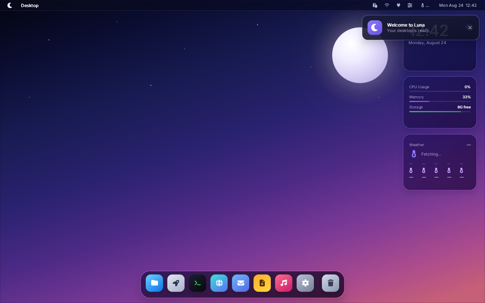
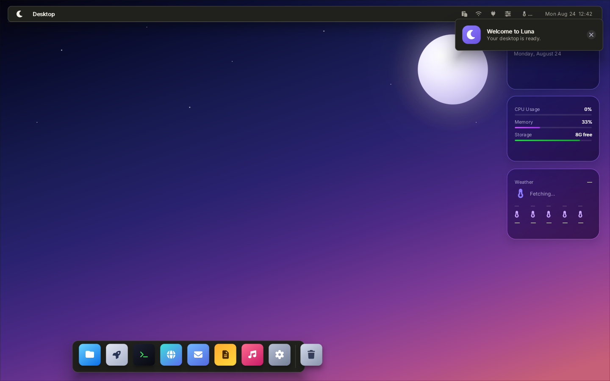
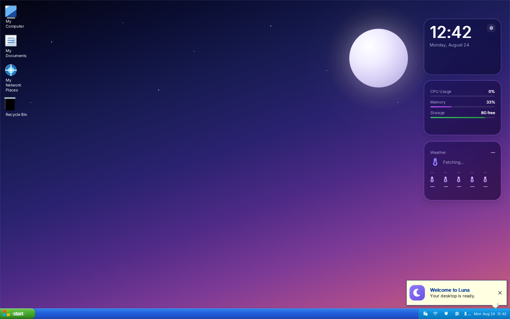
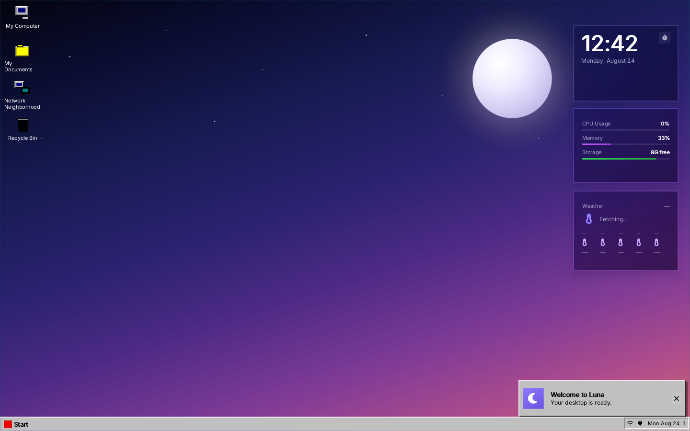
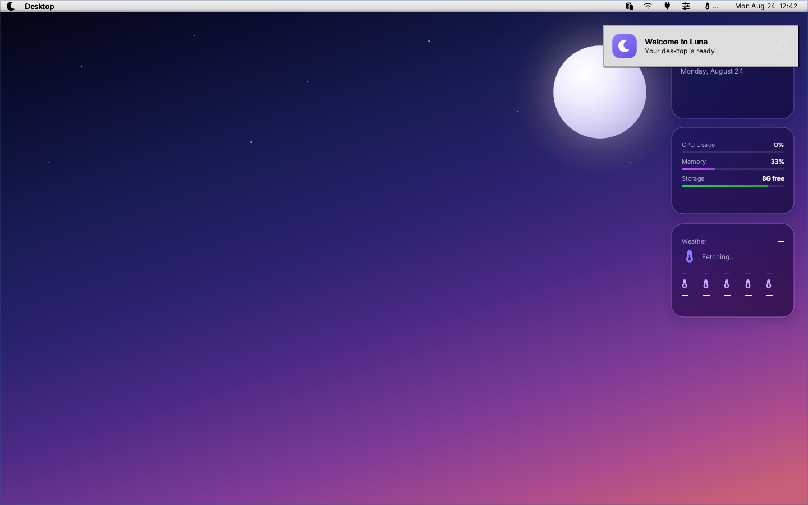
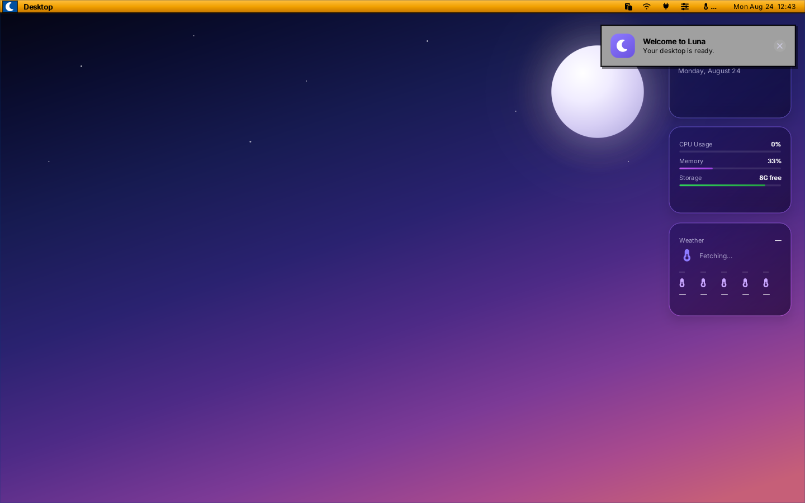

<div align="center">

# 🌙 Luna Desktop

### A lightweight, hackable Linux desktop stack built around Wayland, Rust, and an HTML/CSS-driven native shell.

Luna combines a **Rust Wayland compositor**, a **native C desktop shell powered by Luna UI**, and an optional **Rust `libwayland-client` implementation** into one experimental desktop environment.

[日本語](README.ja.md) · [Sponsor the project](https://github.com/sponsors/yui0)

[](LICENSE)
[](rust-toolchain.toml)
[](https://wayland.freedesktop.org/)
[](https://github.com/sponsors/yui0)

</div>

Luna is designed to be small enough to understand, flexible enough to theme, and low-level enough to experiment with the whole Linux desktop stack—from the Wayland wire protocol and DRM/KMS output to the menu bar, Dock, Launchpad, widgets, and application themes.

> **Project status:** Luna Desktop is under active development. It is already usable as a development desktop/session, but the direct DRM/evdev path is still experimental and should be treated as such on real hardware.

<!-- readme-screenshot-gallery:start -->
## ✨ Desktop skins

Every image below is a **real `luna-shell` framebuffer capture**. The shell is built with its X11/EGL capture backend and run under Xvfb with the named skin; these are not browser previews or recreated mockups. The normal desktop can run through Luna's own KMS/Wayland hosts and does **not** require GLFW.

### Luna — Default

<p align="center">
  
</p>

| Nocturne Atelier | Windows XP |
| --- | --- |
|  |  |

| Windows 95 | Classic Mac OS |
| --- | --- |
|  |  |

| BeOS | Amiga Workbench |
| --- | --- |
|  |  |

Regenerate the gallery with:

```bash
./tools/capture-shell-skins.sh
```
<!-- readme-screenshot-gallery:end -->

## 🚀 What makes Luna different?

| | Luna Desktop |
|---|---|
| **Own the full stack** | A Rust compositor handles the Wayland protocol, composition, input, DRM/KMS and optional browser streaming. |
| **Native shell, web-like styling** | `luna-shell` is a native C program, while Luna UI renders its interface from HTML/CSS-style layouts without embedding a browser. |
| **Theme more than wallpaper** | Skins can change shell layout, chrome placement, widgets, GTK styling, Qt styling and server-side decoration colors. |
| **Multiple rendering paths** | Run on DRM/KMS, use the software backend for development/VM work, or stream a Wayland app to a browser through the WebGL backend. |
| **Wayland implementation playground** | The repository includes both a Rust Wayland server and an optional Rust `libwayland-client.so.0` replacement for protocol/runtime experiments. |

## ⚡ Quick start

Clone with the Luna UI submodule:

```bash
git clone --recurse-submodules https://github.com/Berry-OS/luna-shell.git
cd luna-shell
```

The project uses **Rust nightly** and also builds native C components. Typical development dependencies include GCC, make, pkg-config, Wayland development tools (`wayland-scanner`), DRM/GBM/EGL/OpenGL, libinput, libudev, xkbcommon, D-Bus, X11 and OpenSSL development packages.

### Recommended build

The desktop shell uses the **distribution-provided `libwayland-client` by default**. This is also the path used by the RPM packaging.

```bash
make build-desktop-system
```

If your user/session already has access to the required DRM/input devices, the one-command DRI path is:

```bash
make desktop-system
```

For a software-oriented development session:

```bash
make desktop-soft-system
```

The direct DRI session currently expects a real Linux VT and direct DRM/input access. On machines where that requires elevated privileges, build as your normal user first, then launch the already-built session from a VT with the appropriate permissions, for example:

```bash
sudo LUNA_TTY=/dev/tty2 PROFILE=release ./luna-session
```

Keep SSH or another recovery path available when testing a new compositor on physical hardware.

## 🧩 What is actually in the desktop?

```text
luna-session
├── luna-compositor       Rust Wayland compositor / window manager
├── luna-shell            Native C desktop shell + Luna UI
├── luna-clipboard        Wayland clipboard manager
├── luna-tray-notify      tray / notification helper
└── applications          GTK / Qt / SDL / other Wayland clients
```

| Component | Implementation | Role |
|---|---|---|
| **Luna Desktop** | Full session | The complete desktop environment presented to the user. |
| **`luna-compositor`** | Rust (`wayland-server-rs`) | Wayland server, composition, window management, DRM/KMS, input and alternate rendering backends. |
| **`luna-shell`** | C + Luna UI | Menu bar/taskbar, Dock, Launchpad, Control Center, widgets, settings and desktop chrome. |
| **Luna UI** | `ui/luna-ui` submodule | Native HTML/CSS-style layout and OpenGL rendering engine used by the shell. |
| **`luna-clipboard`** | C | Clipboard persistence/management for the Luna session. |
| **`luna-tray-notify`** | C | Tray/notification compatibility helper. |
| **`wayland-client-rs`** | Rust | Optional libwayland-client-compatible implementation for development and compatibility experiments. |

The internal codename **Vespera** still appears in parts of the source history, but the user-facing desktop is **Luna**.

## 🌙 The shell experience

`ui/luna-shell.c` is the main desktop shell. It renders the desktop using Luna UI and talks to the compositor over Wayland.

Current shell features include:

- translucent Luna menu bar / alternative taskbar and deskbar layouts
- Dock with hover magnification, running-app indicators and Trash
- Launchpad with application discovery, incremental search and keyboard shortcuts
- Control Center and system status UI
- Wi-Fi, Ethernet and Bluetooth integration
- notification toasts and tray/SNI integration
- desktop clock, system-statistics and weather widgets
- monitor/display integration
- language, keyboard-layout and NumLock settings
- keyboard-layout switching for multi-layout configurations
- About This Luna, Log Out, Restart and Shut Down flows
- XDG-based configuration, data, state, cache and runtime paths

Applications are launched as native Wayland clients. `luna-session` exports the usual desktop environment variables for GTK, Qt, Mozilla and SDL so applications can use the Luna compositor directly.

### Override shell applications

Dock and Launchpad entries can be redirected with `LUNA_APP_<NAME>` variables:

```bash
LUNA_APP_TERMINAL=foot ./luna-session
```

The shell layout and stylesheet can also be replaced for development:

```bash
LUNA_DESKTOP_LAYOUT=/path/to/layout.html \
LUNA_DESKTOP_CSS=/path/to/style.css \
./luna-shell --desktop
```

Equivalent `--layout` / `--css` command-line options are available.

## 🎨 Skin system

Open **System Settings → Appearance → Desktop Skin** to switch skins while Luna is running. The selected skin is saved in:

```text
~/.config/luna-shell/settings.conf
```

Bundled skins currently include:

- **Luna / Default**
- **Nocturne Atelier**
- **Windows XP**
- **Windows 95**
- **Classic Mac OS**
- **BeOS**
- **Amiga Workbench**

A skin is not limited to shell colors. It can also describe chrome placement, GTK/Qt integration and compositor decoration preferences.

```text
my-skin/
├── skin.conf
├── style.css
├── layout.html
├── gtk/<ThemeName>/        # optional GTK 3/4 theme
│   ├── index.theme
│   ├── gtk-3.0/gtk.css
│   └── gtk-4.0/gtk.css
└── qt/
    ├── style.qss            # optional Qt stylesheet
    └── colors.conf
```

A minimal `skin.conf` can look like this:

```ini
name=My Skin
description=A custom Luna desktop skin
css=style.css
layout=layout.html

# Shell chrome
chrome=taskbar          # taskbar | deskbar | menubar | luna
menubar_edge=bottom     # top | bottom
menubar_height=34
dock_mode=hidden        # float | hidden

# Application toolkit themes
gtk_theme=LunaWindows95
qt_style=Fusion
qt_qss=qt/style.qss

# Compositor/server-side decorations
titlebar_style=2        # 0 modern | 1 classic dots | 2 flat retro
titlebar_active=#000080
titlebar_inactive=#808080
titlebar_frame=#c0c0c0
prefer_ssd=1
```

`chrome=taskbar`, for example, can move the shell strip to the **bottom** of the display and hide the floating Dock, while `deskbar` / `menubar` keep top-oriented chrome. This is handled by native Wayland layer-surface anchoring rather than CSS positioning alone.

When a skin supplies toolkit metadata, Luna can propagate its appearance to newly launched GTK/Qt applications and update compositor-side decoration colors as well.

Custom skins can be placed in:

```text
~/.local/share/luna-desktop/skins/
/usr/local/share/luna-desktop/skins/
/usr/share/luna-desktop/skins/
```

or in a path named by `LUNA_SKIN_PATH`.

You can also select a skin explicitly:

```bash
luna-shell --desktop --skin windows-95
# or
LUNA_DESKTOP_SKIN=windows-95 luna-shell --desktop
```

For skin development, open `skins/<name>/layout.html` in a browser to iterate on the HTML/CSS structure, then use those same files in Luna. Custom layouts must preserve the shell element IDs expected by `luna-shell` so native actions stay connected.

## 🏗️ Architecture

```text
Linux kernel
   │
   ├─ DRM/KMS + evdev/libinput
   │
   ▼
┌───────────────────────────────┐
│ luna-compositor               │
│ Rust Wayland server           │
│                               │
│ software / DRI+GPU / WebGL    │
└──────────────┬────────────────┘
               │ Wayland
       ┌───────┼───────────────┐
       │       │               │
       ▼       ▼               ▼
  luna-shell  GTK/Qt apps  luna-clipboard
  C + Luna UI
       │
       └─ HTML/CSS-style shell layouts + skins
```

Wayland is the internal desktop bus. A normal Luna session does not need Weston, Mutter or Xorg between Luna and native Wayland applications.

### `wayland-server-rs`

The compositor implements the Wayland wire protocol and object model directly in Rust rather than wrapping `libwayland-server`.

Highlights include:

- `wl_compositor`, `wl_subcompositor`, `wl_shm`, `wl_seat`, `wl_output` and data-device support
- `xdg_wm_base` for application windows
- `zwp_linux_dmabuf_v1` v4 / dmabuf feedback support
- Luna shell/window-management IPC
- evdev input and VT handling
- software composition
- DRM/KMS output
- GPU-assisted rendering paths
- WebGL/WebSocket streaming backend

### `wayland-client-rs`

The repository also contains an experimental Rust implementation that builds a `libwayland-client.so.0`-compatible library and vendors compatible client headers.

It is useful for testing how far a desktop can go without the system client implementation, but it is **not required for the recommended Luna shell build**.

To explicitly build/run the shell against the vendored client implementation:

```bash
make desktop LUNA_WAYLAND_CLIENT=vendored
```

## 🖥️ Rendering and test modes

| Command | Purpose |
|---|---|
| `make desktop-system` | Full DRI desktop using the system Wayland client library. |
| `make desktop-soft-system` | Software-backend desktop using the system Wayland client library. |
| `make desktop LUNA_WAYLAND_CLIENT=vendored` | DRI desktop while testing the Rust client implementation. |
| `make demo` | Start the compositor and connect the sample GTK app; writes compositor screenshots to `/tmp/luna-compositor.ppm`. |
| `make webgl` | Stream the sample GTK app through the compositor's browser backend. |
| `make webgl APP=gtk4-demo` | Run another GTK application through the WebGL backend. |
| `make rpm` | Build the source tarball and RPM package. |

### WebGL mode

```bash
make webgl
# then open http://localhost:8081/
```

Or use the helper directly:

```bash
./run-gtk
./run-gtk gtk4-demo
PORT=9090 ./run-gtk /usr/bin/your-gtk-app
```

The browser receives RGBA frames over WebSocket and sends mouse, keyboard and wheel input back to the compositor.

## 📦 Installing from source

For the recommended system-Wayland-client installation:

```bash
sudo make install-system PREFIX=/usr/local
```

The source install also provides a `luna-desktop.service` unit that can be enabled for a dedicated tty-based session:

```bash
sudo systemctl enable luna-desktop.service
sudo systemctl start luna-desktop.service
```

If you deliberately want Luna's replacement `libwayland-client` installed as part of the Luna prefix, use:

```bash
sudo make install PREFIX=/usr/local
```

Berry Linux packaging uses the distribution Wayland client library and expects the display manager to launch `luna-session` rather than enabling the optional kiosk-style systemd unit.

## ⚠️ Native DRM/VT testing notes

The DRI backend is a real compositor path, not a nested desktop preview. It can take control of DRM/KMS, the active VT and physical input devices.

- use a real Linux VT for direct DRI testing
- `LUNA_TTY=/dev/ttyN` selects the VT explicitly
- `Ctrl+Alt+F1` … `F12` can switch VTs when physical input is enabled
- Luna restores DRM/KD/VT state during normal shutdown
- prefer a normal TERM/session logout over `SIGKILL`, because a killed process cannot run its cleanup path
- `LUNA_PHYSICAL_INPUT=0` disables direct physical input handling when needed
- `LUNA_EGL_SOFTWARE=1` can force software EGL on problematic GPU setups

## 📁 Repository map

```text
luna-shell/
├── Cargo.toml
├── rust-toolchain.toml
├── Makefile
├── luna-session
├── luna-shell.spec
├── run-gtk
│
├── ui/
│   ├── luna-shell.c              # native desktop shell
│   ├── luna-ui/                  # Luna UI git submodule
│   ├── luna-wifi.h
│   ├── luna-ethernet.h
│   ├── luna-bluetooth.h
│   ├── luna-weather.h
│   ├── luna-monitor.h
│   └── protocols/
│
├── skins/                        # shell + GTK + Qt themes
├── docs/screenshots/             # generated real-shell captures
├── clipboard/                    # clipboard helper
├── tray/                         # tray / notification helper
├── systemd/                      # optional desktop service
├── udev/                         # device rules
├── tools/                        # screenshot/gallery tools
│
├── wayland-server-rs/            # Rust Wayland compositor
├── wayland-client-rs/            # optional Rust client library
└── hello-gtk/                    # sample GTK application
```

## 🛠️ Useful build targets

```bash
cargo build
cargo build -p wayland-server-rs --features dri,gpu
cargo build --features webgl

make build
make build-dri
make build-webgl
make build-shell
make build-desktop-system
make clean
```

## 🤝 Contributing

Luna is intentionally experimental. Contributions that improve protocol compatibility, hardware support, shell polish, accessibility, performance, documentation, application compatibility or skin quality are welcome.

When changing shell skins, keep the screenshot gallery reproducible with:

```bash
./tools/capture-shell-skins.sh
```

## 📄 License

Luna Desktop is released under the **Mozilla Public License 2.0 (MPL-2.0)**. See [`LICENSE`](LICENSE).

## ❤️ Support Luna

If you enjoy low-level Linux desktop experiments, custom desktop shells, Wayland internals or delightfully unnecessary retro skins, you can support continued development through [GitHub Sponsors](https://github.com/sponsors/yui0).

---

<div align="center">

**Build the desktop from the wire protocol to the pixels.** 🦀🌙

</div>
